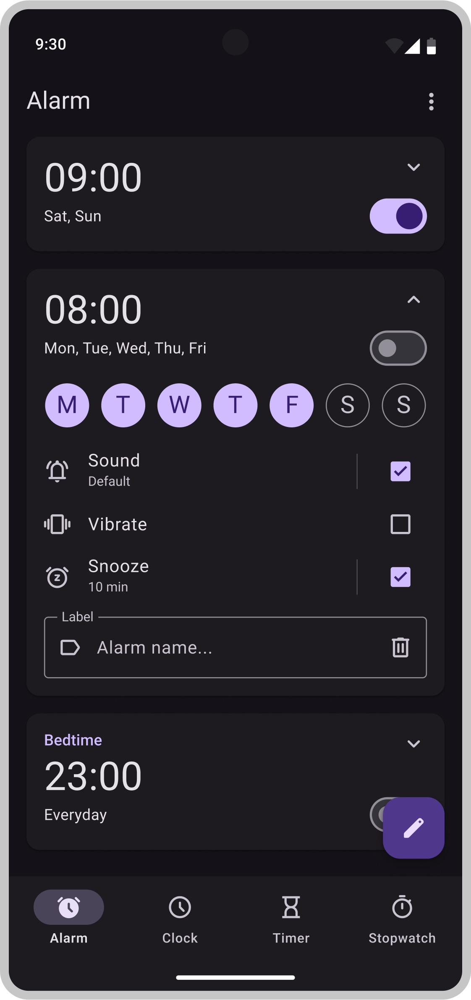

## Material You Mockups
A collection of mockups for a suite of basic android apps, closely following Material Design 3 guidelines.

  

### About
More and more open-source projects are adopting Material Design 3. However simply using the new components does not always result in a clean and beautiful UI. There are many things to consider when designing a user interface, like spacing, alignment, emphasis, reachability, etc. These mockups aim to provide a foundation for creating well structured and nice looking applications with MD3 components. They show heavy use cases and components in various states to provide as much insight as possible. The current goal is to cover all tabs and screens of a suite of basic mobile applications.

### Completion Status

|Apps|Tabs|Screens|
|---|---|---|
|Clock|<ul><li>- [x] Alarm</li><li>- [x] Clock</li><li>- [x] Timer</li><li>- [x] Stopwatch</li></ul>|<ul><li>- [x] Set-Timer</li><li>- [x] Dismiss-Alarm</li></ul>|
|Contacts|<ul><li>- [x] Contacts</li></ul>|<ul><li>- [x] View-Contact</li><li>- [x] Edit-Contact</li></ul>|
|Phone|<ul><li>- [x] Calls</li></ul>|<ul><li>- [x] Dial-Number</li><li>- [ ] Incoming-Call</li><li>- [ ] Active-Call</li></ul>|
|Messages|<ul><li>- [x] Messages</li></ul>|<ul><li>- [ ] Chat</li></ul>|
|Files|<ul><li>- [x] Browse</li><li>- [x] Folders</li><li>- [x] Trash</li></ul>||
|Gallery|<ul><li>- [x] Photos</li><li>- [x] Albums</li><li>- [x] Trash</li></ul>|<ul><li>- [x] View-Image</li><li>- [ ] Watch-Video</li></ul>|
|Calculator|<ul><li>- [ ] Calculator</li></ul>||

### License

 Material You Mockups is licensed under [CC BY-SA 4.0](https://creativecommons.org/licenses/by-sa/4.0/).
